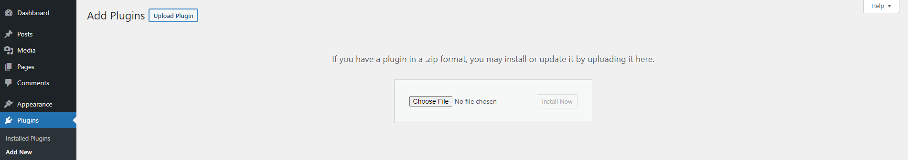
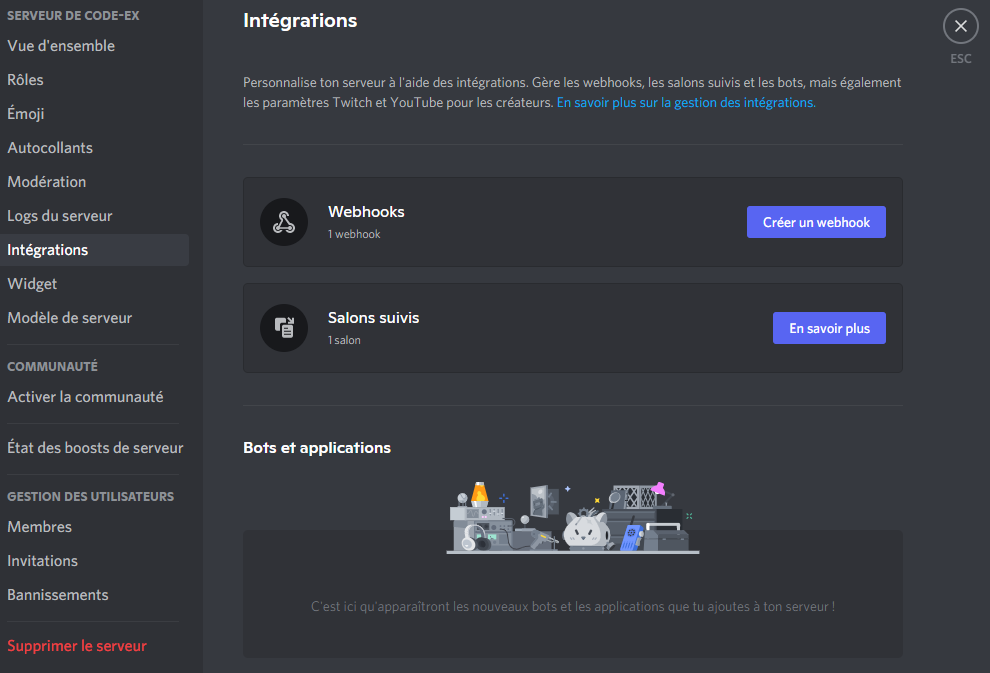
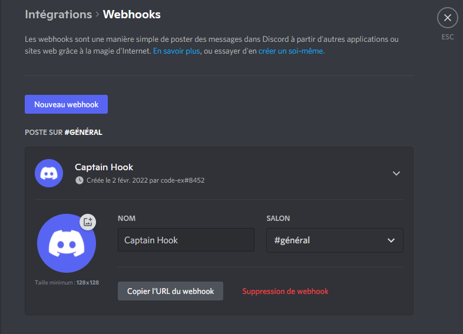
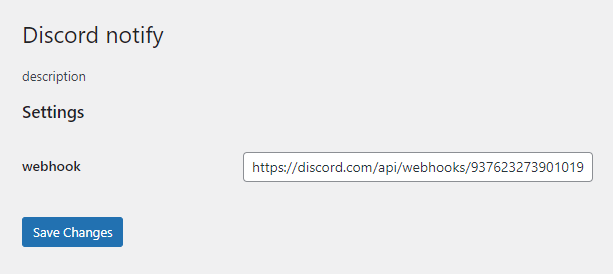

# Discord notify

- [Description](#description)
- [Installation](#installation)
- [Webhook](#webhook)
- [Translator](#translator)

## Description

Discord notify is a plugin Wordpress. This plugin will send a notification when a comment is posted on your wordpress website and he auto translate the message in french

## Installation

to install the plugin you need to add the file discord_notify.php in the folder wp-content/plugin/ on your wordpress server.

if you don't have access to the console on your wordpress you can add with your admin dashbord, you just need to upload the file discord_notify.zip

### Webhook
To get your webhook for your discord server  you need to go settings

### translator

the plugin auto translate a comment in the other language